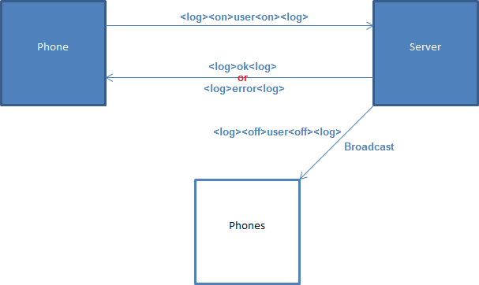
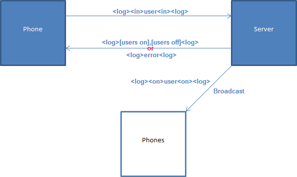
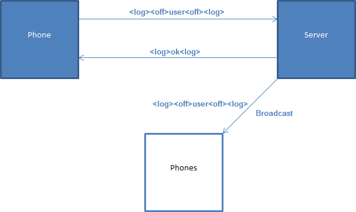
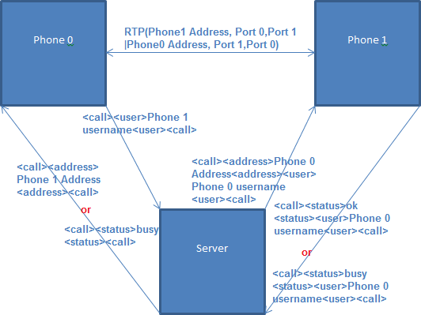

# RTPhone

## Descrição
Construir o protótipo de um sistema de comunicação de voz sobre a internet utilizando RTP a partir de computadores PC. O sistema consiste de dois módulos software: um módulo cliente e um módulo servidor. A comunicação permitida é apenas um-a-um. O servidor gerencia apenas 10 clientes previamente cadastrados. Funcionamento: Quando um cliente é iniciado em um computador, cadastra-se no servidor para informar que está ativo e o endereço {porta, ip} no qual pode ser encontrado. Periodicamente, o cliente envia mensagem ao servidor indicando que está ativo. O servidor muda o status de um cliente para inativo se não recebe uma mensagem após um tempo predeterminado. Quando o ususário1 deseja falar com outro usuário2, ele informa o endereço de e-mail do usuário2 ao cliente e este consulta o servidor para saber se usuário2 está ativo e qual o seu endereço {porta, ip}. A partir daí, se usuário2 está ativo, a comunicação é diretamente entre usuário1 e usuário2, utilizando RTP.

## TODO
* Integração da interface gráfica

## Protocolo PTS (Phone to Server)
* XML Like:
 
    * `<type>value<type>`

            e.g. 
                <user>DAVID<user>
                <log><in>DAVID<in><log>

* Formas errôneas de utilização:

    * `<type><type>value<type><type>`

            e.g. 
                <user><user>DAVID<user><user>

    * `<type0>value<type1>value<type1><type0>`

            e.g. 
                <user>DAVID<IP>10.10.10.10<IP><user>

* Formas corretas de utilização:

	* `<type>value0<type><type>value1<type>`

            e.g. 
                <user>DAVID<user><user>KAIRO<user>

	* `<type0><type1>value<type1><type2>value<type2><type0>`

            e.g. 
                <user><username>DAVID<username><IP>10.10.10.10<IP><user>

* Diagrama:

    * Registro

		
    
    * Login

		
    
    * Logoff

		
    
    * Ligação

		

    * OBS.:
	* O array é representado por [], não necessariamente precisa estar organizado por tipo.
		e.g. 
			[users on]=<in>user 0<in><in>user 1<in><in>user 2<in><in>user 3<in><in>user 4<in>
		e.g. 
			[users on],[users off]=<in>user 0<in><off>user 1<off><in>user 2<in><in>user 3<in><off>user 4<off>